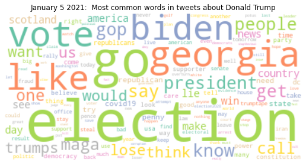
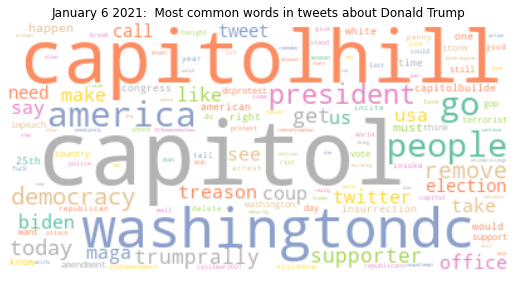
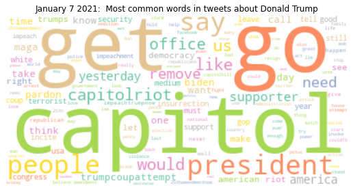
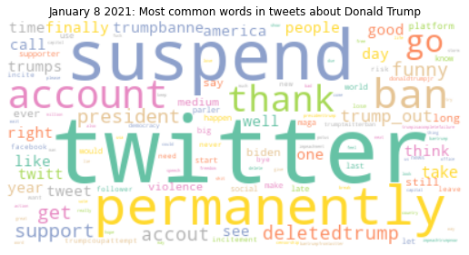
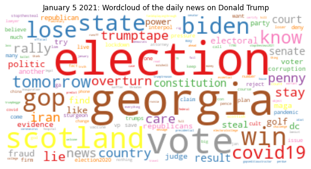
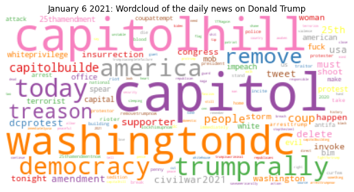
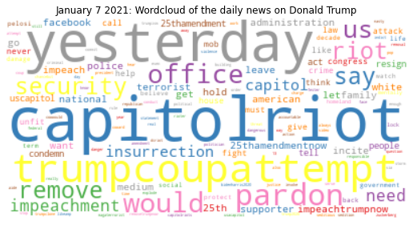
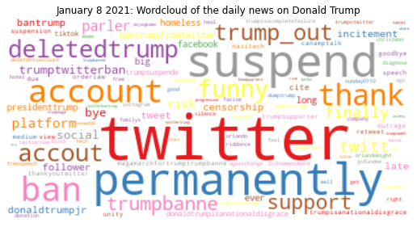

In light of this week's riots in Capitol Hill and the subsequent ban of Donald Trump's account on Twitter I ventured to do an exploratory analysis of the public tweets about Donald Trump from January 5 to January 8 2021.

In the first part of this notebook I am scraping Twitter posts that include the keyword 'Trump' for each of the days that I am interested in and saving the result set of the API search in CSV file and then reading that into a pandas dataframe.

In order to avoid using my personal Twitter developer account to scrape data each time this notebook runs, I edited it into a view-only version. 
I am thus not running the original code cells and showing the final visuals from locally saved files.


```python
from twitterscraper import query_tweets
import pandas as pd
import tweepy
```

In the cell below I am connecting to my personal Twitter developer key and so I have erased my key info in the following cell.

In order to run a Tweepy search you would need to fill the following cell with your Twitter developer key info.


```python
consumer_key = ""
consumer_secret = ""
access_token = ""
access_token_secret = ""
```


```python
# Creating the authentication object
auth = tweepy.OAuthHandler(consumer_key, consumer_secret)
# Setting your access token and secret
auth.set_access_token(access_token, access_token_secret)
# Creating the API object while passing in auth information
api = tweepy.API(auth, wait_on_rate_limit=True)
```


```python
#Extracting tweets that include keyword 'Trump' from Jan 5 2021
tweets=[] #to hold the extracted tweets
search = "#Trump -filter:retweets"
for tweet in tweepy.Cursor(api.search, q=search, limit=None, tweet_mode='extended', lang="en", since="2021-01-05", until="2021-01-06").items(50000):
    
    try:
        data=[tweet.user._json['screen_name'], tweet.full_text]
        tweets.append(data)
        
    except tweepy.TweepError as e:
        print(e.reason)
        continue
    except StopIteration:
        break
```

I will be saving the results of the tweepy seach as a CSV file on my local repository


```python
#saving the data as csv locally to avoid running the Tweet API connection each time
df5= pd.DataFrame(tweets, columns=['user','text'])
df5.to_csv(path_or_buf = '/Users/sozeta/Desktop/DATASETS CSV/DF5.csv', index=False) 
```


```python
#Extracting tweets that include keyword 'Trump' from Jan 6 2021
sleep_on_rate_limit=False
tweets=[]
search = "#Trump -filter:retweets"
for tweet in tweepy.Cursor(api.search, q=search, limit=None, tweet_mode='extended', lang="en", since="2021-01-06", until="2021-01-07").items(50000):
    
    try:
        data=[tweet.user._json['screen_name'], tweet.full_text]
        date= tuple(data)
        tweets.append(data)
        
    except tweety.TweepError as e:
        print(e.reason)
        continue
    except StopIteration:
        break
```


```python
df6= pd.DataFrame(tweets, columns=['user','text'])
df6.to_csv(path_or_buf = '/Users/sozeta/Desktop/DATASETS CSV/DF6.csv', index=False) 
```


```python
#Extracting tweets that include keyword 'Trump' from Jan 7 2021
search = "#Trump -filter:retweets"
tweets=[]
for tweet in tweepy.Cursor(api.search, q=search, limit=None, tweet_mode='extended', lang="en", since="2021-01-07", until="2021-01-08").items(50000):
    
    try:
        data=[tweet.user._json['screen_name'], tweet.full_text]
        date= tuple(data)
        tweets.append(data)
        
    except tweety.TweepError as e:
        print(e.reason)
        continue
    except StopIteration:
        break
```


```python
df7= pd.DataFrame(tweets, columns=['user','text'])
df7.to_csv(path_or_buf = '/Users/sozeta/Desktop/DATASETS CSV/DF7.csv', index=False) 
```


```python
#Extracting tweets that include keyword 'Trump' from Jan 8 2021
search = "#Trump -filter:retweets"
tweets=[]
for tweet in tweepy.Cursor(api.search, q=search, limit=None, tweet_mode='extended', lang="en", since="2021-01-08", until="2021-01-09").items(50000):
    
    try:
        data=[tweet.user._json['screen_name'], tweet.full_text]
        date= tuple(data)
        tweets.append(data)
        
    except tweety.TweepError as e:
        print(e.reason)
        continue
    except StopIteration:
        break
```


```python
df8= pd.DataFrame(tweets, columns=['user','text'])
df8.to_csv(path_or_buf = '/Users/sozeta/Desktop/DATASETS CSV/DF8.csv', index=False) 
```

Now that I have all my data locally stored I will go ahead and create custom methods for cleaning the tweets stored in each dataframe in preparation for the word analysis I want to engage in.


```python
#cleaning the tweets
import numpy as np
import re

#function for removing a pattern in a string
def remove_pattern(input_txt, pattern):
    r = re.findall(pattern, input_txt)
    for i in r:
        input_txt = re.sub(i, '', input_txt)        
    return input_txt

def clean_tweets(tweets):
    #remove twitter Return handles (RT @xxx:)
    tweets = np.vectorize(remove_pattern)(tweets, "RT @[\w]*:") 
    
    #remove twitter handles (@xxx)
    tweets = np.vectorize(remove_pattern)(tweets, "@[\w]*")
    
    #remove URL links (httpxxx)
    tweets = np.vectorize(remove_pattern)(tweets, "https?://[A-Za-z0-9./]*")
    
    #remove special characters, numbers
    tweets = np.core.defchararray.replace(tweets, "[^a-zA-Z]", " ")
    
    return tweets
```


```python
import nltk
from nltk.corpus import stopwords
nltk.download('stopwords')
```


```python
import string
from emot.emo_unicode import EMOTICONS

#create set of stopwords and add my own
stop_words = set(stopwords.words('english'))
extra_words = ['trump', 'donald','#trump','#donald','#donaldtrump','&amp;','amp','donaldtrump','likeamp']
stop_words.update(extra_words)
len(stop_words)

def tweet_prep(tweets):
    #remove apostrophes
    tweets.text = np.vectorize(remove_pattern)(tweets.text, "'")
    tweets.text = np.vectorize(remove_pattern)(tweets.text, "|")
    #remove emojis
    emoji_pattern = re.compile("["
                           u"\U0001F600-\U0001F64F"  # emoticons
                           u"\U0001F300-\U0001F5FF"  # symbols & pictographs
                           u"\U0001F680-\U0001F6FF"  # transport & map symbols
                           u"\U0001F1E0-\U0001F1FF"  # flags (iOS)
                           u"\U00002702-\U000027B0"
                           u"\U000024C2-\U0001F251"
                           "]+", flags=re.UNICODE)
    
    tweets.text = np.vectorize(remove_pattern)(tweets.text, emoji_pattern)
    
    #remove punctuation
    tweets.text = tweets.text.str.replace('[^\w\s]','')
    tweets.text = tweets.text.str.replace('\n','')
    tweets.text = tweets.text.str.replace('  ','')
    #lowerlcase letters
    tweets.text = tweets.text.apply(lambda x: x.lower())
    return tweets
```


```python
nltk.download('wordnet')
```


```python
import spacy
from spacy.lemmatizer import Lemmatizer
from spacy.lookups import Lookups
import en_core_web_sm
sp= spacy.load("en_core_web_sm")
lookups = Lookups()
lemm = Lemmatizer(lookups)

#Function that converts each word in a list to its lemma version
def lemma_function(tweets):
    dummy = []
    incoming=' '.join(tweets.text)
    for word in sp(incoming):
        dummy.append(word.lemma_)
    #remove items from list that are not useful
    for item in dummy[:]:
        if (item=="-PRON-" or item=='  ' or item=='   '  or len(item)<2 or item in stop_words):
            dummy.remove(item)
    return dummy
```

The functions defined above will clear the Twitter data sufficiently in order for me to analyze word distribution across the tweets.

Now I will import my data from the CSV files and then apply the cleaning functions defined above.


```python
#Creating a pandas dataframe for each data file
df5=pd.read_csv("desktop/DATASETS CSV/DF5.csv")
df6=pd.read_csv("desktop/DATASETS CSV/DF6.csv")
df7=pd.read_csv("desktop/DATASETS CSV/DF7.csv")
df8=pd.read_csv("desktop/DATASETS CSV/DF8.csv")
```


```python
#Cleaning the tweets saved in each dataframe
df5['text']=clean_tweets(df5['text'])
df6['text']=clean_tweets(df6['text'])
df7['text']=clean_tweets(df7['text'])
df8['text']=clean_tweets(df8['text'])
```


```python
#Creating a list of the lemma version of each word in each tweet after proper cleaning of the tweet
#the "clean_tweets" function updates the original tweet to remove extraneous information
#the "tweet_prep" function returns a new object that excludes information that is not pertinent to this project but could be pertinent elsewhere
words5=lemma_function(tweet_prep(df5))
words6=lemma_function(tweet_prep(df6))
words7=lemma_function(tweet_prep(df7))
words8=lemma_function(tweet_prep(df8))
```

I will be using Counter objects to keep track of word frequencies


```python
#Creating a dictionary of words and their frequencies for each dataset(aka day)
from collections import Counter 
Counter5 = Counter(words5)
Counter6 = Counter(words6)
Counter7 = Counter(words7)  
Counter8 = Counter(words8) 
```

I will visualize the word frequency distribution of the tweets for each day through Python's WordCloud art.


```python
#WordCloud art of the most common words in the Jan 5 tweets around Donald Trump
from wordcloud import WordCloud
import matplotlib.pyplot as plt
wordcloud = WordCloud(stopwords=stop_words, background_color="white", prefer_horizontal=1, colormap='Set2', max_words=150, collocations=False).generate_from_frequencies(Counter5)
fig=plt.figure(figsize=(9, 9))
plt.imshow(wordcloud, interpolation='bilinear')
plt.axis("off")
plt.title('January 5 2021:  Most common words in tweets about Donald Trump')
plt.show()
```

Since I am not running the code in this view-only notebook I am using a locally saved image of the WordCloud created in the code above 


```python
from IPython.display import Image
Image("Most common words in tweets about Trump Jan 5.png")
```


    

    


```python
#WordCloud art of the most common words in the Jan 6 tweets around Donald Trump
wordcloud = WordCloud(stopwords=stop_words, background_color="white", prefer_horizontal=1, max_words=150, colormap='Set2', collocations=False).generate_from_frequencies(Counter6)
fig=plt.figure(figsize=(9, 9))
plt.imshow(wordcloud, interpolation='bilinear')
plt.axis("off")
plt.title('January 6 2021:  Most common words in tweets about Donald Trump')
plt.show()
```


```python
Image("Most common words in tweets about Trump Jan 6.png")
```


    

    


```python
#WordCloud art of the most common words in the Jan 7 tweets around Donald Trump
wordcloud = WordCloud(stopwords=stop_words, background_color="white", prefer_horizontal=1, colormap='Set2', max_words=150, collocations=False).generate_from_frequencies(Counter7)
fig=plt.figure(figsize=(9, 9))
plt.imshow(wordcloud, interpolation='bilinear')
plt.axis("off")
plt.title('January 7 2021:  Most common words in tweets about Donald Trump')
plt.show()
```


```python
Image("Most common words in tweets about Trump Jan 7.png")
```


    

    


```python
#WordCloud art of the most common words in the Jan 8 tweets around Donald Trump
wordcloud = WordCloud(stopwords=stop_words, background_color="white", prefer_horizontal=1, colormap='Set2', max_words=150, collocations=False).generate_from_frequencies(Counter8)
fig=plt.figure(figsize=(9, 9))
plt.imshow(wordcloud, interpolation='bilinear')
plt.axis("off")
plt.title('January 8 2021: Most common words in tweets about Donald Trump')
plt.show()
```


```python
Image("Most common words in tweets about Trump Jan 8.png")
```


    

    


After creating graphs for the most common words used in tweets about Donald Trump each day from Jan.5 to Jan.8, I want to create similar graphs that weigh the frequency of each word on a given day against its frequency on other days.  

Below I create a basic algorithm to achieve that given the 4-day dataset we have:  
    value_of_word_day1= frequency_day1 - ((frequency_day2+frequency_day3+frequency_day4)/3)</br>  
    
The resulting graphs highlight the newsworthy words of each day relating to Donald Trump as gathered through Twitter.


```python
DF_5 = {}
for i in range(len(words5)):
    count= Counter5[words5[i]]
    commonality=0
    if words5[i] in words6:
        commonality+= Counter6[words5[i]]
    if words5[i] in words7:
        commonality+= Counter7[words5[i]]
    if words5[i] in words8:
        commonality+= Counter8[words5[i]]
    if commonality==0:
        value=count
    else: 
        denominator=(commonality/3)
        value=count-denominator
    DF_5[words5[i]]=value
```


```python
DF_6 = {}
for i in range(len(words6)):
    count= Counter6[words6[i]]
    commonality=0
    if words6[i] in words6:
        commonality+= Counter5[words6[i]]
    if words6[i] in words7:
        commonality+= Counter7[words6[i]]
    if words6[i] in words8:
        commonality+= Counter8[words6[i]]
    if commonality==0:
        value=count
    else: 
        denominator=(commonality/3)
        value=count-denominator
    DF_6[words6[i]]=value
```


```python
DF_7 = {}
for i in range(len(words7)):
    count= Counter7[words7[i]]
    commonality=0
    if words7[i] in words5:
        commonality+= Counter5[words7[i]]
    if words7[i] in words6:
        commonality+= Counter6[words7[i]]
    if words7[i] in words8:
        commonality+= Counter8[words7[i]]
    if commonality==0:
        value=count
    else: 
        denominator=(commonality/3)
        value=count-denominator
    DF_7[words7[i]]=value
```


```python
DF_8 = {}
for i in range(len(words8)):
    count= Counter8[words8[i]]
    commonality=0
    if words8[i] in words5:
        commonality+= Counter5[words8[i]]
    if words8[i] in words6:
        commonality+= Counter6[words8[i]]
    if words8[i] in words7:
        commonality+= Counter7[words8[i]]
    if commonality==0:
        value=count
    else: 
        denominator=(commonality/3)
        value=count-denominator
    DF_8[words8[i]]=value
```


```python
#WordCloud art of the most newsworthy words in the Jan 5 tweets around Donald Trump
wordcloud = WordCloud(stopwords=stop_words, background_color="white", prefer_horizontal=1, colormap='Set1', max_font_size=60, max_words=150, collocations=False).generate_from_frequencies(DF_5)
fig=plt.figure(figsize=(9, 9))
plt.imshow(wordcloud, interpolation='bilinear')
plt.axis("off")
plt.title('January 5 2021: Wordcloud of the daily news on Donald Trump')
plt.show()
```


```python
Image("WordCould of daily news on Donald Trump on Twitter Jan 5.png")
```


    

    


```python
#WordCloud art of the most newsworthy words in the Jan 6 tweets around Donald Trump
wordcloud = WordCloud(stopwords=stop_words, background_color="white", prefer_horizontal=1, colormap='Set1', max_font_size=60, max_words=150, collocations=False).generate_from_frequencies(DF_6)
fig=plt.figure(figsize=(9, 9))
plt.imshow(wordcloud, interpolation='bilinear')
plt.axis("off")
plt.title('January 6 2021: Wordcloud of the daily news on Donald Trump')
plt.show()
```


```python
Image("WordCloud of daily news on Donald Trump on Twitter Jan 6.png")
```


    

    


```python
#WordCloud art of the most newsworthy words in the Jan 7 tweets around Donald Trump
wordcloud = WordCloud(stopwords=stop_words, background_color="white", max_font_size=60, colormap='Set1', prefer_horizontal=1, max_words=150, collocations=False).generate_from_frequencies(DF_7)
fig=plt.figure(figsize=(9, 9))
plt.imshow(wordcloud, interpolation='bilinear')
plt.axis("off")
plt.title('January 7 2021: Wordcloud of the daily news on Donald Trump')
plt.show()
```


```python
Image("WordCloud of daily news on Donald Trump on Twitter Jan 7.png")
```


    

    


```python
#WordCloud art of the most newsworthy words in the Jan 8 tweets around Donald Trump
wordcloud = WordCloud(stopwords=stop_words, background_color="white", prefer_horizontal=1, colormap='Set1', max_font_size=60, max_words=150, collocations=False).generate_from_frequencies(DF_8)
fig=plt.figure(figsize=(9, 9))
plt.imshow(wordcloud, interpolation='bilinear')
plt.axis("off")
plt.title('January 8 2021: Wordcloud of the daily news on Donald Trump')
plt.show()
```


```python
Image("WordCloud of daily news on Donald Trump on Twitter Jan 8.png")
```


    

    


